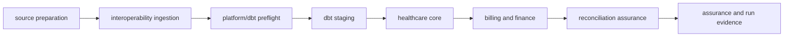

# Platform workflow dependencies

Milestone 10 encodes the dependency chain as orchestration metadata rather than business logic.

The authoritative dbt selector mapping is:

| Layer | Selector |
|---|---|
| staging | `path:models/staging` |
| core | `tag:core` |
| billing | `tag:billing` |
| finance | `tag:finance` |
| assurance | `tag:assurance` |

Source validation precedes transformation. Billing and finance precede assurance. Evidence generation follows assurance.
