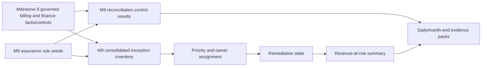

# Reconciliation and revenue assurance architecture

Milestone 9 adds a bounded assurance layer over the governed billing and finance outputs from Milestone 8.

## Responsibility boundary

Milestone 8 remains the owner of tariff selection, contract matching, invoice and claim totals, payment allocation, revenue events, outstanding balances and daily finance controls. Milestone 9 consumes those outputs through dbt `ref()` and adds:

- reconciliation control results;
- consolidated exceptions;
- deterministic owner, severity, priority and remediation state;
- revenue-at-risk summaries with double-count prevention;
- daily and month-end assurance evidence interfaces.

Milestone 9 does not query raw sources directly and does not implement orchestration, notification, dashboard, mart, semantic-model or external workflow integrations.

## Flow

The models are implemented in `dbt/models/intermediate/assurance` and `dbt/models/curated/assurance`.

## Local validation posture

The layer is parseable and statically guarded without Snowflake credentials. Runtime contracts and connected builds remain `declared_not_runtime_proven` until an authorised Snowflake target is available.
