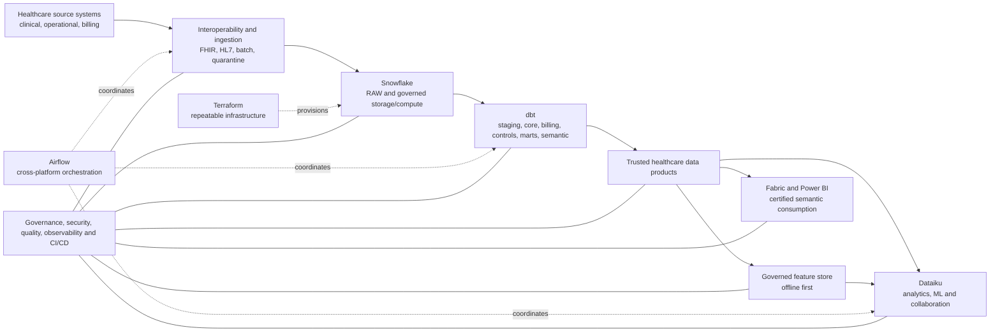
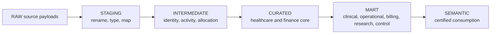

# Healthcare Enterprise Data Platform target state

## Status legend

- **Implemented:** working locally and validated.
- **Partially implemented:** useful working/design assets exist, but the target capability is incomplete.
- **Planned:** assigned to a defined milestone.
- **Future extension:** intentionally outside the current implementation sequence or dependent on evidence.

## Platform context

The target platform turns clinical, operational and financial source activity into governed healthcare data products for analytics, research, machine learning and reporting. Snowflake and dbt remain the centre of gravity: Snowflake supplies governed storage/compute and security enforcement; dbt owns transformations, tests, lineage, dimensional models, contracts and shared business logic.

This is a target-state responsibility diagram, not deployment evidence.

## Source systems and healthcare domains

**Implemented:** deterministic synthetic organisations, locations, providers, patients, encounters, admissions/discharges, appointments, pathways, clinical events, pathology, medication, research consent/cohorts, audit, quality events, and billing/finance source records in CSV and JSON Lines.

**Partially implemented:** referrals, observations, diagnoses and procedures are represented as clinical-event categories rather than independent conformed entities. FHIR-inspired resources exist only as clearly labelled non-conformant examples.

**Planned:** explicit treatment/procedure assessment and external revenue-assurance workflows over the governed Milestone 8/Milestone 9 billing and assurance outputs.

Source categories ultimately include EPR/PAS, laboratory, pharmacy, community/virtual care, scheduling/waiting list, finance/billing, contract/reference, research/consent and platform audit sources. Production connectivity is not implemented.

## Interoperability and ingestion layer

**Implemented locally for the bounded M4 subset:** validate synthetic FHIR-inspired resources and HL7-like messages; map identifiers and terminology to canonical source contracts; retain original payloads; route rejected messages with reason, rule version and correlation identifier to quarantine. Batch CSV/JSON remains a supported source path.

FHIR and HL7 own source interoperability, not warehouse business transformation. Formal conformance may be claimed only after a named validator/profile and repeatable evidence exist.

## Snowflake platform and data layers

**Placeholder only / planned (M3 onward):** the repository contains modular SQL and Terraform design scaffolding but no Snowflake deployment.

The target uses environment-isolated databases and managed-access schemas, workload-specific warehouses, resource monitors, Time Travel and controlled clones. RAW preserves immutable source payload/provenance. STAGING, INTERMEDIATE, CURATED, MART and SEMANTIC align with existing layer definitions; serving interfaces expose approved products. Snowflake enforces RBAC, masking, row access, secure views/shares, audit and usage/cost telemetry.

## dbt modelling layers

**Partially implemented (M5–M9):** one dbt project parses without credentials, declares RAW/GOVERNANCE/billing/finance source contracts with freshness metadata, creates source-aligned staging views, adds conformed healthcare core models, publishes governed billing/finance dimensions, facts and controls, and adds reconciliation/exception/revenue-assurance models. It intentionally contains no marts or semantic models.

dbt owns source definitions/freshness, source-aligned staging, reusable intermediate logic, conformed healthcare dimensions/facts, billing/finance models, reconciliation controls, snapshots, incrementals, contracts, documentation, exposures, semantic definitions and shared business rules. Revenue-event classification, balances, tariffs, waiting time and consent must not be independently recalculated downstream. Milestone 8 implements governed billing/finance calculations but not formal revenue recognition.

## Orchestration

**Implemented locally (M10):** Airflow coordinates cross-platform dependencies, sensors, retries, backfills, failure handling and evidence workflows through local-first DAGs that invoke existing CLI and dbt contracts. Snowflake Tasks continue to own Snowflake-local change graphs; dbt continues to own model selection/execution semantics. One workflow has one trigger owner.

## Analytics, machine learning and feature store

**Dataiku implemented locally as blueprints (M11):** governed collaborative preparation, model-specific feature engineering, experimentation, operationalisation design and model monitoring consume trusted products. Dataiku does not become a second warehouse transformation layer.

**Feature store implemented locally as offline foundation (M12):** reusable feature definitions, entity keys, owners, versions, freshness and point-in-time logic are registered over trusted dbt products. Offline access is first; online serving remains a future extension requiring a demonstrated latency use case.

## Fabric and Power BI

**Implemented locally as metadata blueprints (M13):** Fabric and Power BI provide the governed downstream consumption layer. The repository defines workspace topology, Snowflake-to-Power BI connectivity decisions, one shared enterprise semantic model, central measures and KPIs, RLS/OLS, sensitivity mapping, refresh groups, incremental refresh policies, deployment-pipeline stages and thin-report specifications.

The implementation is metadata only: no Fabric workspace, capacity, lakehouse, notebook, pipeline, Power BI dataset, report publication, refresh history or certification is claimed. Fabric and Power BI consume governed products and do not recreate dbt, Dataiku or feature-store logic.

## Governance and security

**Implemented locally as registry and simulation (M14):** classification, sensitivity,
domains, personas, purposes, access policies, masking/row/object/export/retention/audit
controls, service identities, separation of duties, consent-aware research access and
control mappings are defined centrally. Existing Snowflake, dbt, Airflow, Dataiku,
feature-store and Power BI ownership remains unchanged.

No deployed control is claimed. Live identity-provider enforcement, live Snowflake policy
attachment, Purview labelling, Power BI security deployment, legal retention, data-subject
request handling and compliance certification remain outside the local registry.

## Quality, observability and operational assurance

**Implemented locally:** generator validation, deterministic manifests/checksums, negative-test registration and CI quality gates.

**Planned incrementally:** FHIR/HL7 rejection metrics, dbt freshness/contracts/artifacts, Snowflake query/access/load/task and cost telemetry, billing control totals, Airflow/Dataiku/Fabric outcomes, feature freshness, SLOs, alerts and runbooks. Monitoring observes owners; it does not redefine domain truth.

## CI/CD and infrastructure provisioning

**Implemented locally as protected-delivery foundation (M15):** credential-free GitHub
Actions validate Python, YAML, SQL, Terraform, Markdown, dbt structure, secrets,
governance and deployment controls. The repository defines DEV → TEST → PROD promotion,
plan-before-apply metadata, environment approvals, service-identity boundaries, release
and deployment manifests, drift simulation, rollback design and checksum evidence.

No live apply, GitHub environment administration or cloud deployment is claimed. Future
work may add authorised protected environments, short-lived authentication, live plan/apply
evidence, dbt Slim CI, and repeatable broader platform provisioning.

## Multi-region design

**Implemented locally as symbolic recovery design (M16):** regional roles, residency
policies, recovery tiers, RTO/RPO portfolio targets, dependency graph, platform recovery
mappings, failover criteria, failback controls, local simulations, recovery manifests and
checksum evidence are defined. No live region, Snowflake replication, DNS change, platform
restore or failover exercise is claimed.

## Evidence and current non-goals

**Partially implemented:** Milestone 2 includes local manifests, checksums, validation reports and tests. Every future claim must link to redacted, reproducible evidence for a commit and environment.

Current non-goals are live Snowflake execution, formal revenue recognition, production Airflow deployment, live Dataiku execution, production ML approval, online feature serving, live Fabric/Power BI deployment or refresh, live governance enforcement, formal compliance certification, Terraform apply, live failover, automatic production rollback, cloud deployment and multi-region execution. Those capabilities remain planned rather than implied by existing metadata blueprints.
