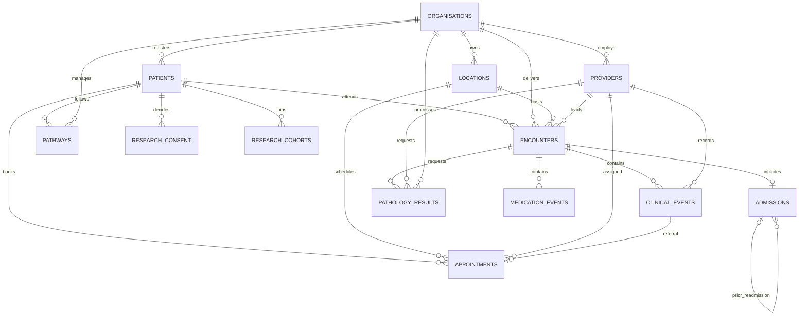

# Entity relationships

Audit events reference synthetic platform actors and object labels rather than foreign keys to clinical entities. Data-quality events identify the affected dataset and synthetic record through a generic reference so deliberately malformed negative fixtures can still be described.
